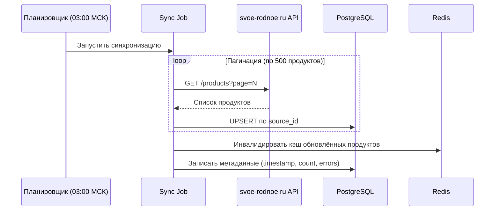
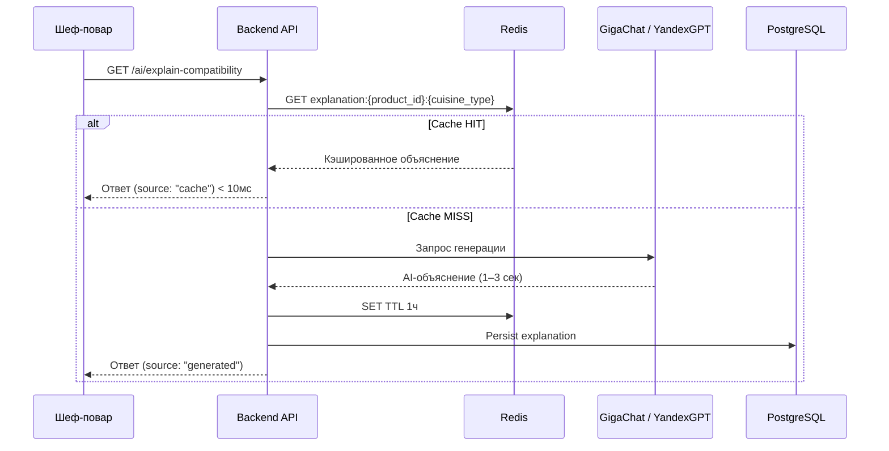

# Асинхронные взаимодействия

## Сценарий 1: Синхронизация каталога svoe-rodnoe.ru

### Контекст

Каталог продуктов не запрашивается при каждом открытии дашборда — это создало бы realtime-зависимость от внешнего API. Вместо этого **фоновый job синхронизирует данные раз в 24 часа**.

### Поток



### Сравнение технологий

| Технология | Плюсы | Минусы |
|---|---|---|
| **node-cron** | Простота, нет зависимостей | Нет retry, нет мониторинга |
| **Celery + Redis** | Retry, мониторинг (Flower), распределённость | Сложность для хакатона |
| **pg_cron** | Не нужен внешний брокер | Ограничен возможностями |
| **AWS EventBridge** | Managed, надёжно | Привязка к облаку, избыточно для MVP |

**Выбор: node-cron (MVP) → Celery + Redis (production)**

### Краевые случаи

| Сценарий | Поведение |
|---|---|
| API недоступен | Лог ошибки; кэш остаётся от прошлой синхронизации |
| Частичная ошибка (timeout 10%) | `partial_failure`; следующий запуск завершит обновление |
| Повторный запуск | UPSERT по `source_id` — идемпотентно |
| Redis недоступен | Обновляется только PostgreSQL; инвалидация через TTL |

---

## Сценарий 2: Генерация AI-объяснений совместимости

### Контекст

При открытии карточки продукта запрашивается AI-объяснение совместимости с кухней. Генерация через LLM занимает 1–3 секунды. Кэширование оптимизирует стоимость.

### Поток



### Краевые случаи

| Сценарий | Поведение |
|---|---|
| LLM API недоступен | Шаблонное объяснение из справочника (fallback) |
| Rate limit превышен | HTTP 429 + «Слишком много запросов, подождите 1 мин» |
| Нерелевантный ответ LLM | Валидация длины (50–300 символов); при провале — шаблон |
| Токены LLM закончились | Алерт команде; fallback на шаблонные тексты |

---

## Сценарий 3: Отслеживание действий (аналитика)

### Контекст

Каждый просмотр карточки, переход к фермеру и применение фильтра логируется для KPI (CTR, MAU, популярные продукты). Запись не блокирует основной UX.

### Поток

```
Frontend → fire-and-forget POST /api/v1/events → append в ClickHouse
```

**Выбор: fire-and-forget HTTP + ClickHouse**

В production (v2.0) — Kafka как буфер между приложением и ClickHouse.

### Контракт события

```json
{
  "event_type": "product_view | farmer_click | filter_applied",
  "restaurant_id": "string",
  "user_id": "string",
  "product_id": "string",
  "session_id": "string",
  "timestamp": "2025-05-15T14:32:00Z",
  "metadata": {
    "source_screen": "dashboard | catalog | product_card",
    "filter_applied": "category:berry"
  }
}
```
