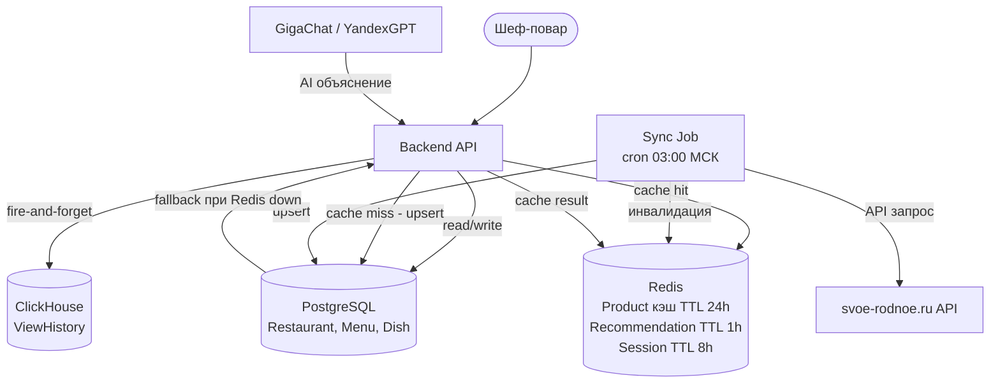

# Хранение данных

## 1. Сущности и атрибуты

| Сущность | Атрибуты | Описание |
|---|---|---|
| **Restaurant** | id, name, owner_user_id, cuisine_type, cuisine_confidence, created_at, updated_at | Профиль ресторана |
| **Menu** | id, restaurant_id, raw_text, dishes_json, uploaded_at, file_hash | Загруженное меню |
| **Dish** | id, menu_id, name, category, ingredients_hints[] | Блюдо из меню |
| **Product** | id, name, category, subcategory, compatible_cuisines[], badges[], farmer_id, cached_at | Продукт из каталога (кэш) |
| **Season** | id, product_id, start_month, end_month, is_year_round | Сезонные окна продукта |
| **Farmer** | id, name, region, profile_url, cached_at | Фермер (кэш) |
| **Recommendation** | id, restaurant_id, product_id, ai_explanation, menu_matches_json, generated_at, ttl | AI-рекомендация |
| **CuisineType** | id, name_ru, name_en, compatible_categories[] | Справочник типов кухонь |
| **UserSession** | id, user_id, restaurant_id, created_at, expires_at | Сессия пользователя |
| **ViewHistory** | id, restaurant_id, product_id, viewed_at | История просмотров |

---

## 2. Матрица критериев выбора хранилища

| Критерий | Restaurant / Menu | Product / Farmer (кэш) | Recommendation | ViewHistory | CuisineType |
|---|---|---|---|---|---|
| Объём данных | Малый | Средний (~100K) | Малый (ротация 24ч) | Большой (млн строк) | Очень малый |
| Паттерн записи | Редкая (обновление меню) | Batch раз в 24ч | При генерации | Append-only | При обновлении справочника |
| Паттерн чтения | Точечное | Частое с фильтрами | Точечное (ключ) | Агрегированное | Полное (весь справочник) |
| Консистентность | Strong | Eventual (кэш до 24ч) | Eventual | Eventual | Strong |
| Транзакции | Нужны | Не нужны | Не нужны | Не нужны | Не нужны |
| Поиск | По ID | Полнотекстовый + фильтры | По составному ключу | Аналитика | Нет |

---

## 3. Итоговое решение

| Сущность | Хранилище | Обоснование |
|---|---|---|
| **Restaurant, Menu, Dish** | **PostgreSQL** | Транзакционные операции, связанные данные (menu→dishes), нужны JOIN'ы. PostgreSQL поддерживает JSONB для `dishes_json`. |
| **Product, Season, Farmer** (кэш) | **Redis** (горячий, TTL 24ч) + **PostgreSQL** (fallback) | Продукты читаются при каждом открытии дашборда. Redis обеспечивает отклик менее 1 мс. PostgreSQL — резерв при рестарте Redis. |
| **Recommendation** | **Redis** (TTL 1ч) + **PostgreSQL** | AI-генерация дорога по токенам. Кэшируем на 1 час по ключу `{product_id}:{cuisine_type}`. |
| **ViewHistory** | **ClickHouse** | Append-only данные в больших объёмах + агрегации. ClickHouse превосходит PostgreSQL в аналитике в 10–100x. |
| **CuisineType** | **YAML-конфиг** (in-memory) | Справочник до 100 строк, меняется редко. Загружается при старте приложения. |
| **UserSession** | **Redis** | Типовой use case Redis: TTL 8ч, быстрый lookup по токену. |

### Почему не выбраны альтернативы

| Отвергнутый вариант | Причина отказа |
|---|---|
| MongoDB для всего | Нет транзакций и JOIN'ов; критично для Menu/Dish |
| Elasticsearch для продуктов | Операционная сложность для MVP; PostgreSQL + pg_trgm достаточен |
| ClickHouse для всего | Не поддерживает UPDATE/DELETE; неприемлемо для Menu и Restaurant |
| SQLite | Не масштабируется при concurrent-нагрузке 500+ пользователей |

---

## 4. Диаграмма потоков данных

