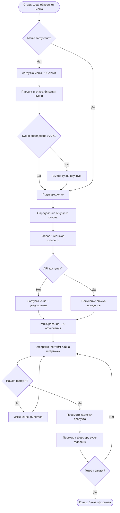

# 04. BPMN Диаграмма процесса

---

## 1. Основной бизнес-процесс: «Планирование сезонного меню»

### Описание процесса

Процесс охватывает путь шеф-повара от решения обновить меню до выбора конкретного фермера для закупки сезонного продукта.

**Участники (дорожки / swim lanes):**
- **Шеф-повар** — инициирует и управляет процессом
- **Сервис дашборда сезонности** — обрабатывает данные и формирует рекомендации
- **Каталог svoe-rodnoe.ru** — предоставляет данные о продуктах и фермерах

---

### BPMN-описание (текстовая нотация)

```
[START EVENT] → Шеф решает обновить меню под новый сезон

[TASK: Шеф] Открывает раздел «Дашборд сезонности» в ЛК svoe-shef.ru

[GATEWAY: Exclusive] Меню уже загружено?
  → ДА: переход к [TASK: Сервис] Определение текущего сезона
  → НЕТ: переход к [TASK: Шеф] Загрузка меню

[TASK: Шеф] Загрузка меню (PDF/текст)
[TASK: Сервис] Парсинг меню → извлечение блюд
[TASK: Сервис] Классификация типа кухни (AI)

[GATEWAY: Exclusive] Тип кухни определён с уверенностью >70%?
  → ДА: [TASK: Шеф] Подтверждает тип кухни
  → НЕТ: [TASK: Шеф] Выбирает тип кухни вручную

[TASK: Сервис] Определение текущего сезона по системной дате
[TASK: Сервис] Запрос к каталогу svoe-rodnoe.ru (фильтр: сезон + кухня)

[GATEWAY: Exclusive] API svoe-rodnoe.ru доступен?
  → ДА: [TASK: Каталог] Возврат списка продуктов
  → НЕТ: [TASK: Сервис] Загрузка кэша (TTL 24ч) + показ уведомления

[TASK: Сервис] Ранжирование продуктов (в сезоне → скоро → заканчивается)
[TASK: Сервис] Генерация AI-объяснений совместимости
[TASK: Сервис] Отображение тайм-лайна сезонности и карточек продуктов

[TASK: Шеф] Просматривает тайм-лайн, применяет фильтры

[GATEWAY: Exclusive] Нашёл подходящий продукт?
  → ДА: [TASK: Шеф] Открывает детальную карточку продукта
  → НЕТ: [TASK: Шеф] Меняет фильтры / смотрит следующий месяц (возврат к фильтрации)

[TASK: Шеф] Читает объяснение совместимости и список блюд для обновления
[TASK: Шеф] Нажимает «Перейти к фермеру»

[TASK: Каталог] Открывает карточку фермера на svoe-rodnoe.ru

[GATEWAY: Exclusive] Шеф готов к заказу?
  → ДА: [TASK: Шеф] Оформляет заказ на svoe-rodnoe.ru
  → НЕТ: [TASK: Шеф] Возвращается к дашборду

[END EVENT] → Продукт выбран; шеф готов к обновлению меню
```

---

### Mermaid-диаграмма (упрощённая)



---

## 2. DMN-таблица: «Определение статуса сезонности продукта»

### Назначение

Определить статус отображения продукта в тайм-лайне дашборда: **В сезоне / Скоро начнётся / Заканчивается / Вне сезона**.

### Обоснование необходимости

Сезонное окно продукта — сложное правило: зависит от текущего месяца, месяца начала и конца сезона, а также от допустимого «окна предупреждения» (за сколько недель предупредить). Без формализованной таблицы решение рассыпается в if-else и становится неуправляемым при добавлении новых продуктов.

### Входные параметры

| Параметр | Тип | Описание |
|---|---|---|
| `current_month` | Integer (1–12) | Текущий месяц |
| `season_start_month` | Integer (1–12) | Месяц начала сезона продукта |
| `season_end_month` | Integer (1–12) | Месяц окончания сезона продукта |
| `weeks_to_start` | Integer | Количество недель до начала сезона |
| `weeks_to_end` | Integer | Количество недель до конца сезона |

### DMN-таблица решений

| # | current_month in [season_start..season_end] | weeks_to_start | weeks_to_end | **Выход: статус** | Цвет |
|---|---|---|---|---|---|
| 1 | true | — | > 4 | `IN_SEASON` | 🟢 Зелёный |
| 2 | true | — | ≤ 4 | `ENDING_SOON` | 🔴 Красный |
| 3 | false | ≤ 4 | — | `STARTING_SOON` | 🟡 Жёлтый |
| 4 | false | > 4 | — | `OUT_OF_SEASON` | ⚫ Серый |

### Логика работы (сценарии)

| Сценарий | Описание | Статус |
|---|---|---|
| **Принято — в сезоне** | Земляника, июль. Сезон июнь–август. До конца >4 нед. | `IN_SEASON` 🟢 |
| **Заканчивается** | Земляника, конец июля. До конца сезона 2 недели | `ENDING_SOON` 🔴 |
| **Скоро начнётся** | Белый гриб, конец августа. Сезон начинается через 3 недели (сентябрь) | `STARTING_SOON` 🟡 |
| **Вне сезона** | Земляника, декабрь. Сезон закончился 4 месяца назад | `OUT_OF_SEASON` ⚫ |

### Краевые случаи

- **Зимующие продукты** (например, корнеплоды: октябрь–март): сезон перекрывает год. Обрабатываем через проверку с переносом (`season_start > season_end → сезон через Новый год`).
- **Круглогодичные продукты** (мёд, крупы): статус всегда `IN_SEASON`, показываются без цветовой индикации.
- **Замороженные продукты**: помечаются отдельным тегом `FROZEN`, сезонность не применяется.