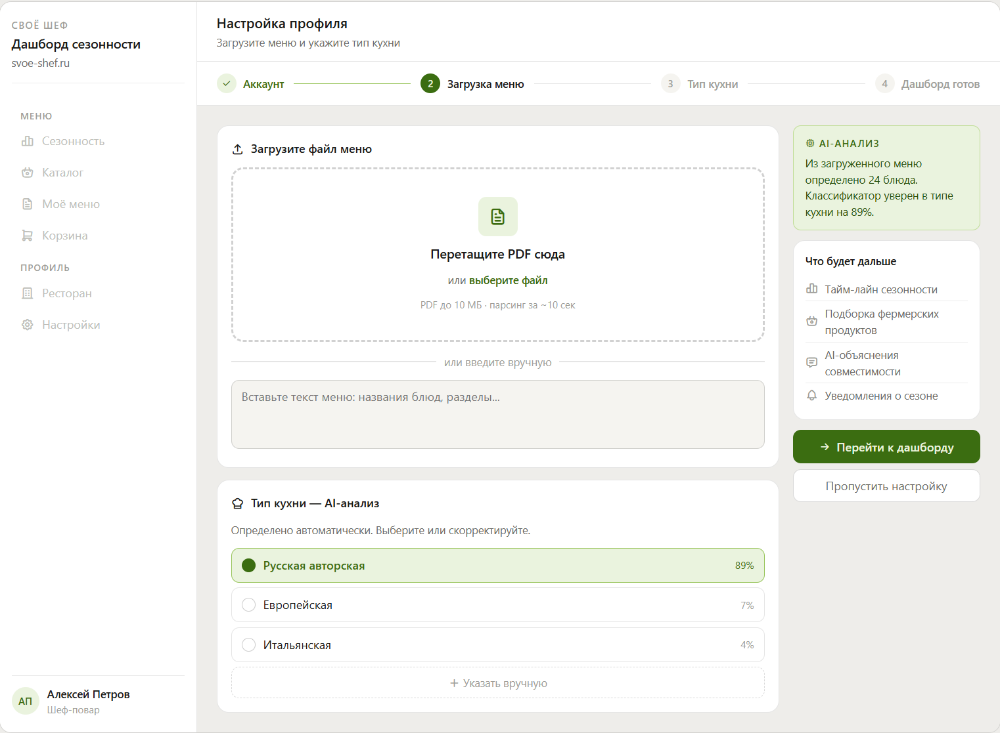
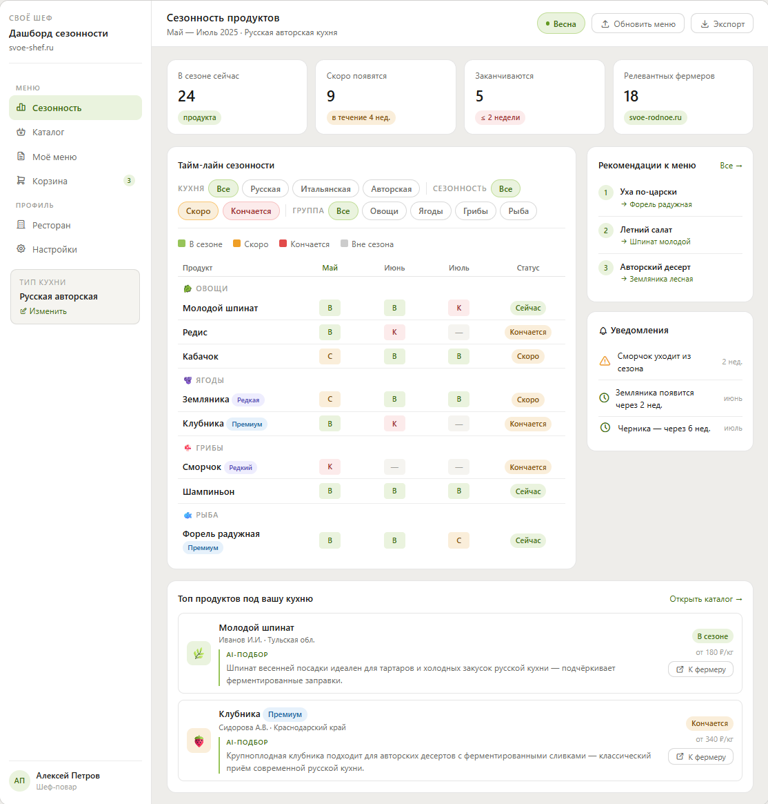
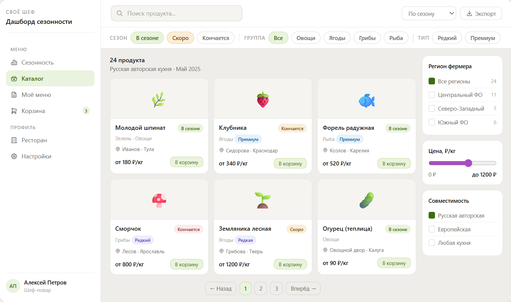
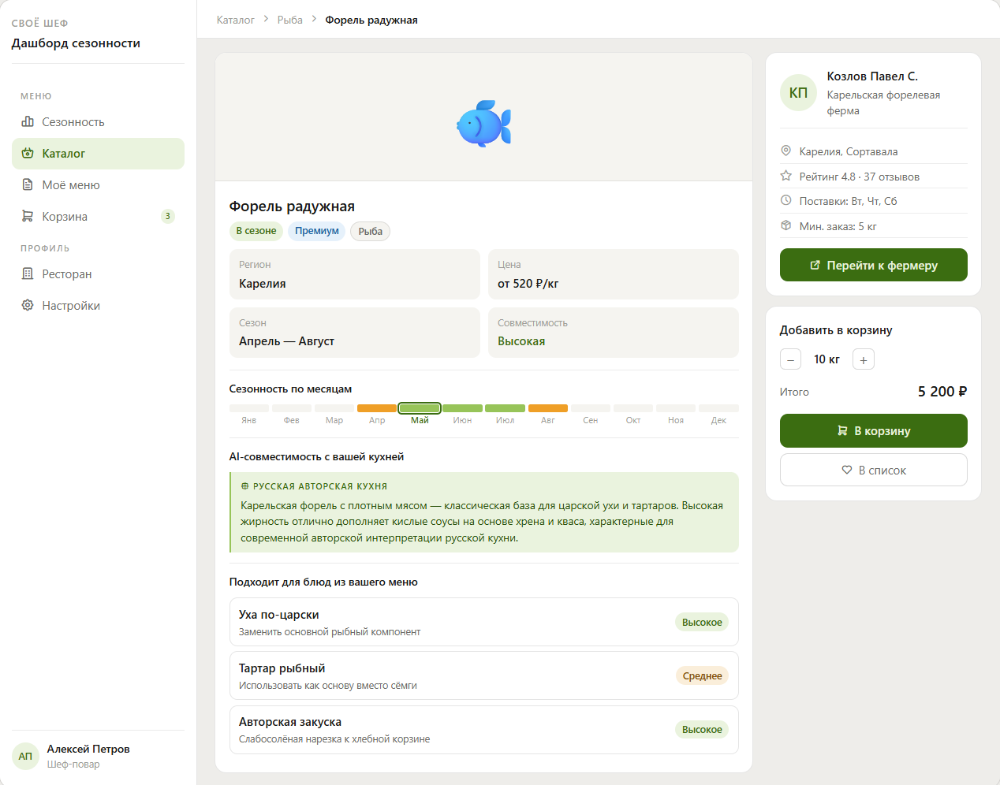
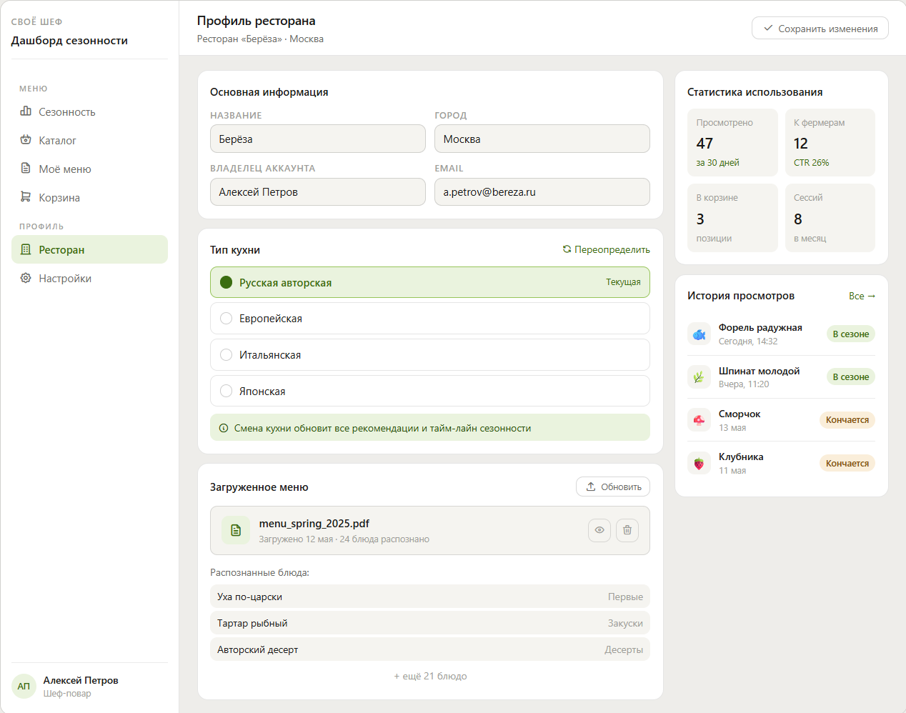
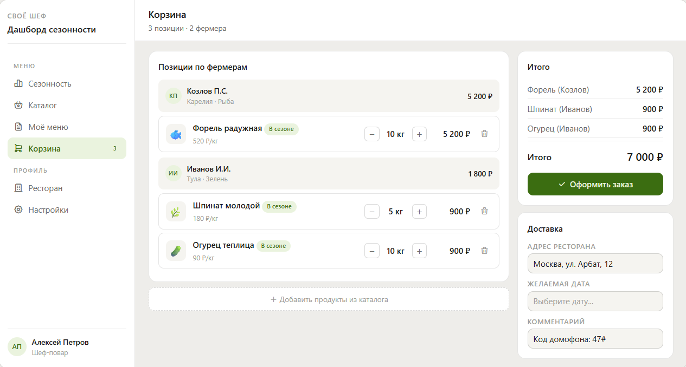

# 05. Проектирование UI и API

---

## 1. Список экранов

| # | Экран | Назначение |
|---|---|---|
| S-01 | **Онбординг / Загрузка меню** | Первичная настройка: загрузка меню и выбор типа кухни |
| S-02 | **Дашборд сезонности (главный экран)** | Визуальный тайм-лайн сезонности с фильтрами |
| S-03 | **Каталог продуктов** | Карточки продуктов с фильтрацией и сортировкой |
| S-04 | **Детальная карточка продукта** | Подробная информация о продукте + рекомендации по меню |
| S-05 | **Профиль ресторана** | Настройки: тип кухни, загруженное меню, история |
| S-06 | **Корзина / Оформление заказа** | Собранные продукты для закупки; передача заказа фермерам |

---

### Описание экранов


**S-01 Онбординг / Загрузка меню**
- Drag-and-drop зона для PDF или поле вставки текста
- Кнопка "Выбрать тип кухни вручную"
- Выпадающий список типов кухонь (из справочника)
- Индикатор прогресса обработки
- Кнопка "Перейти к дашборду"



**S-02 Дашборд сезонности**
- Заголовок с текущим месяцем и сезоном
- Горизонтальный тайм-лайн: продукты x 3 месяца
- Цветовые метки статуса (зелёный / жёлтый / красный / серый)
- Панель фильтров: категория / статус / тип (редкий, премиальный)
- Блок "Рекомендации к обновлению меню" (топ-5 продуктов)
- Кнопка "Корзина" с бейджем количества товаров



**S-03 Каталог продуктов**
- Карточки продуктов (фото, название, категория, статус сезонности, бейджи, имя фермера)
- Сортировка: по сезону / по категории / по статусу
- Фильтры: категория, регион, статус, тип
- Кнопка "В корзину" на каждой карточке



**S-04 Детальная карточка продукта**
- Фото, название, категория, регион
- Статус сезонности + тайм-лайн конкретного продукта
- Бейджи: редкий / премиальный
- AI-объяснение совместимости с кухней ресторана
- Блок "Можно использовать в блюдах": список блюд из меню шефа
- Кнопка "Перейти к фермеру" (svoe-rodnoe.ru, новая вкладка)
- Кнопка "Добавить в корзину"
- 


**S-05 Профиль ресторана**
- Название ресторана, тип кухни (редактируемый)
- Загруженное меню (просмотр / замена)
- История просмотренных продуктов
- Кнопка "Обновить меню"



**S-06 Корзина / Оформление заказа**
- Список добавленных продуктов: фото, название, фермер, количество, цена
- Возможность изменить количество или удалить позицию
- Группировка по фермерам
- Итоговая сумма
- Кнопка "Оформить заказ"



---

## 2. Таблица роутов

| Экран | URL | Описание | Переходы |
|---|---|---|---|
| S-01 | `/dashboard/onboarding` | Загрузка меню и выбор кухни | -> S-02 после завершения |
| S-02 | `/dashboard/seasonality` | Главный дашборд сезонности | -> S-03, S-04, S-05, S-06 |
| S-03 | `/dashboard/products` | Каталог продуктов с фильтрами | -> S-04 |
| S-04 | `/dashboard/products/:productId` | Карточка конкретного продукта | -> svoe-rodnoe.ru (новая вкладка), -> S-06, <- S-03 |
| S-05 | `/dashboard/profile` | Профиль ресторана | -> S-01 (обновление меню), <- S-02 |
| S-06 | `/dashboard/cart` | Корзина и оформление заказа | -> подтверждение заказа, <- S-02/S-03/S-04 |

---

## 3. Таблицы endpoints по экранам

### S-01 Онбординг

| UI элемент | Действие | Метод | Endpoint | Описание |
|---|---|---|---|---|
| Загрузка PDF | Upload | `POST` | `/api/v1/menu/upload` | Парсинг PDF-меню |
| Вставка текста | Submit | `POST` | `/api/v1/menu/parse-text` | Парсинг текста меню |
| Получить список кухонь | Load | `GET` | `/api/v1/cuisine-types` | Справочник типов кухонь |
| Сохранить тип кухни | Submit | `PUT` | `/api/v1/restaurant/cuisine` | Обновление типа кухни ресторана |

### S-02 Дашборд

| UI элемент | Действие | Метод | Endpoint | Описание |
|---|---|---|---|---|
| Загрузка тайм-лайна | Load | `GET` | `/api/v1/seasonality/timeline?months=3` | Тайм-лайн на 3 месяца |
| Применить фильтр | Filter | `GET` | `/api/v1/products?category=&status=&type=` | Фильтрованный список |
| Блок рекомендаций | Load | `GET` | `/api/v1/recommendations?limit=5` | Топ-5 рекомендаций |

### S-03 Каталог

| UI элемент | Действие | Метод | Endpoint | Описание |
|---|---|---|---|---|
| Список продуктов | Load | `GET` | `/api/v1/products` | Все продукты с пагинацией |
| Фильтрация | Filter | `GET` | `/api/v1/products?category=&region=&status=` | Фильтрованный список |
| Сортировка | Sort | `GET` | `/api/v1/products?sort=season_status` | Сортированный список |
| Добавить в корзину | Add | `POST` | `/api/v1/cart/items` | Добавление продукта в корзину |

### S-04 Карточка продукта

| UI элемент | Действие | Метод | Endpoint | Описание |
|---|---|---|---|---|
| Загрузка карточки | Load | `GET` | `/api/v1/products/:id` | Детальные данные продукта |
| AI-объяснение | Generate | `POST` | `/api/v1/ai/explain-compatibility` | Генерация объяснения |
| Рекомендации по меню | Load | `GET` | `/api/v1/products/:id/menu-matches` | Блюда из меню для продукта |
| Переход к фермеру | Navigate | `GET` | `/api/v1/products/:id/farmer-link` | Ссылка на svoe-rodnoe.ru |
| Добавить в корзину | Add | `POST` | `/api/v1/cart/items` | Добавление продукта в корзину |

### S-05 Профиль ресторана

| UI элемент | Действие | Метод | Endpoint | Описание |
|---|---|---|---|---|
| Загрузка профиля | Load | `GET` | `/api/v1/restaurant` | Данные ресторана |
| Обновить профиль | Submit | `PATCH` | `/api/v1/restaurant` | Обновление полей ресторана (название, тип кухни и пр.) |
| Заменить меню | Upload | `POST` | `/api/v1/menu/upload` | Загрузка нового меню |

### S-06 Корзина / Заказ

| UI элемент | Действие | Метод | Endpoint | Описание |
|---|---|---|---|---|
| Загрузка корзины | Load | `GET` | `/api/v1/cart` | Текущая корзина ресторана |
| Изменить количество | Update | `PATCH` | `/api/v1/cart/items/:itemId` | Обновление количества позиции |
| Удалить из корзины | Delete | `DELETE` | `/api/v1/cart/items/:itemId` | Удаление позиции |
| Оформить заказ | Submit | `POST` | `/api/v1/orders` | Создание заказа из корзины |
| История заказов | Load | `GET` | `/api/v1/orders` | Список заказов ресторана |

---

## 4. JSON-схемы ключевых сущностей

### Product (Продукт)

```json
{
  "id": "string",
  "name": "string",
  "category": "string",
  "subcategory": "string",
  "images": ["string"],
  "season": {
    "start_month": "integer",
    "end_month": "integer",
    "is_year_round": "boolean"
  },
  "seasonality_status": "enum(IN_SEASON, ENDING_SOON, STARTING_SOON, OUT_OF_SEASON)",
  "badges": ["string"],
  "farmer": {
    "id": "string",
    "name": "string",
    "region": "string",
    "profile_url": "string"
  },
  "price_per_kg": "float",
  "compatible_cuisines": ["string"],
  "description": "string",
  "source_url": "string"
}
```

### Menu (Меню ресторана)

```json
{
  "id": "string",
  "restaurant_id": "string",
  "cuisine_type": "string",
  "dishes": [
    {
      "id": "string",
      "name": "string",
      "category": "string",
      "ingredients_hints": ["string"]
    },
    {
      "id": "string",
      "name": "string",
      "category": "string",
      "ingredients_hints": ["string"]
    }
  ],
  "uploaded_at": "datetime"
}
```

### Restaurant (Ресторан)

```json
{
  "id": "string",
  "name": "string",
  "owner_user_id": "string",
  "cuisine_type_id": "string",
  "cuisine_type_name": "string",
  "cuisine_confidence": "float",
  "created_at": "datetime",
  "updated_at": "datetime"
}
```

### Recommendation (Рекомендация)

```json
{
  "product_id": "string",
  "product_name": "string",
  "seasonality_status": "enum(IN_SEASON, ENDING_SOON, STARTING_SOON, OUT_OF_SEASON)",
  "ai_explanation": "string",
  "menu_matches": [
    {
      "dish_id": "string",
      "dish_name": "string",
      "match_reason": "string"
    }
  ],
  "generated_at": "datetime"
}
```

### SeasonalityTimeline

```json
{
  "current_month": "integer",
  "current_season": "string",
  "restaurant_cuisine_type": "string",
  "months": [
    {
      "month": "integer",
      "month_name": "string",
      "products": [
        {
          "product_id": "string",
          "name": "string",
          "category": "string",
          "status": "enum(IN_SEASON, ENDING_SOON, STARTING_SOON, OUT_OF_SEASON)",
          "badges": ["string"]
        }
      ]
    }
  ]
}
```

### Cart (Корзина)

```json
{
  "id": "string",
  "restaurant_id": "string",
  "items": [
    {
      "id": "string",
      "product_id": "string",
      "product_name": "string",
      "farmer_id": "string",
      "farmer_name": "string",
      "quantity_kg": "integer",
      "price_per_kg": "integer",
      "total_price": "integer"
    }
  ],
  "total_price": "integer",
  "items_count": "integer",
  "created_at": "datetime",
  "updated_at": "datetime"
}
```

### Order (Заказ)

```json
{
  "id": "string",
  "restaurant_id": "string",
  "status": "string",
  "items": [
    {
      "id": "string",
      "product_id": "string",
      "product_name": "string",
      "farmer_id": "string",
      "farmer_name": "string",
      "quantity_kg": "integer",
      "price_per_kg": "integer",
      "total_price": "integer"
    }
  ],
  "total_price": "integer",
  "delivery_address": "string",
  "comment": "string",
  "created_at": "datetime",
  "updated_at": "datetime"
}
```


В файле `api.yaml` в папке `media` находится описание api контракта


## 6. Примечание по Figma

Для отрисовки UI-макетов в Figma используйте плагин **[Figma MCP](https://www.figma.com/community/plugin/figma-mcp)** или **Figma Dev Mode**.

Чтобы подключить Figma к Claude через MCP, необходимо:
1. Открыть Claude Desktop -> Settings -> Developer -> Edit Config
2. Добавить в `claude_desktop_config.json`:
```json
{
  "mcpServers": {
    "figma": {
      "command": "npx",
      "args": ["-y", "figma-mcp"],
      "env": {
        "FIGMA_API_KEY": "ВАШ_FIGMA_API_KEY"
      }
    }
  }
}
```
3. Получить API-ключ в Figma: Account Settings -> Security -> Personal access tokens
4. Перезапустить Claude Desktop

После подключения можно передавать ссылку на фрейм Figma и Claude сможет читать/описывать макеты. Самостоятельно рисовать в Figma через MCP Claude не умеет — MCP предоставляет read-доступ к существующим файлам.

Для создания макетов рекомендуется использовать **Figma AI** (встроен в Figma) или описать экраны команде дизайна на основе описаний S-01...S-06 из раздела 1 этого файла.
